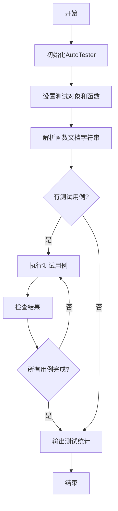
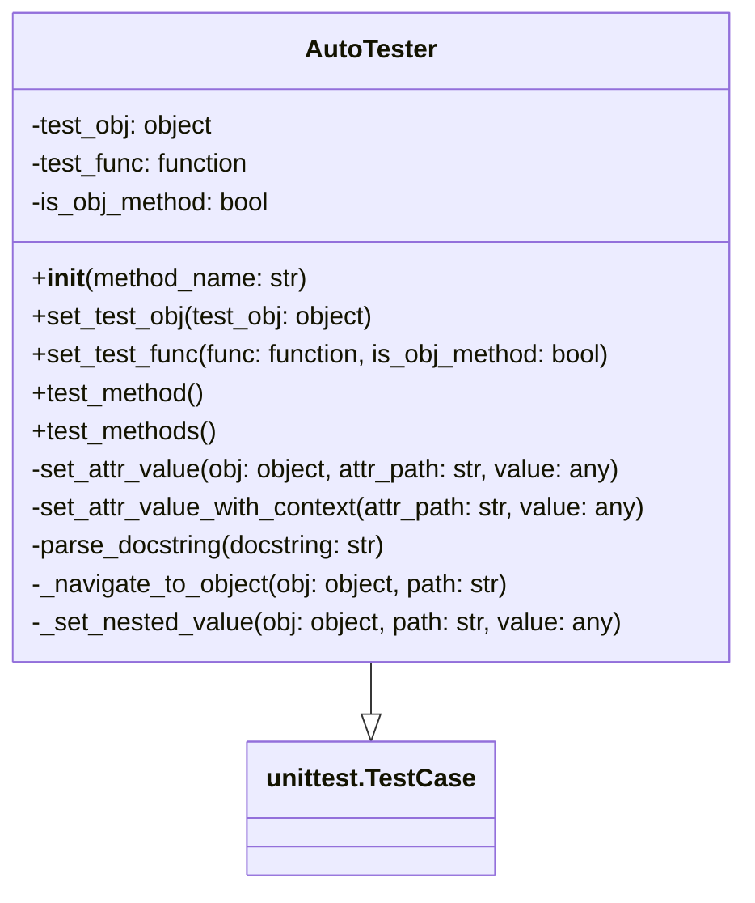

# py_auto_tester

Python自动化单元测试工具 - 一个简单易用的Python单元测试自动化库

## 功能特性

- 🔍 **自动测试发现**: 自动发现项目中的测试文件
- 🚀 **一键运行**: 简单命令即可运行所有测试
- 📊 **详细报告**: 提供详细的测试结果统计
- 🛠️ **模板生成**: 快速生成测试模板代码
- 📈 **覆盖率支持**: 集成代码覆盖率分析（可选）
- 🖥️ **命令行接口**: 友好的CLI工具

## 安装

```bash
pip install py-auto-tester
```

## 快速开始

### 1. 基本使用

```python
from py_auto_tester import AutoTester

# 创建测试器实例
tester = AutoTester()

# 发现测试文件
tests = tester.discover_tests()
print(f"发现 {len(tests)} 个测试文件")

# 运行测试
results = tester.run_tests()
print(f"测试结果: {results['passed']}/{results['total']} 通过")
```

### 2. 命令行使用

```bash
# 运行当前目录下tests文件夹中的所有测试
py-auto-tester

# 指定测试目录
py-auto-tester --dir my_tests

# 显示详细输出
py-auto-tester --verbose

# 生成测试模板
py-auto-tester --template MyClass --output test_myclass.py

# 从源文件自动生成测试（根据docstring中的测试用例）
py-auto-tester --from-file example_source.py --output test_example.py

# 只为特定类生成测试
py-auto-tester --from-file example_source.py --class-filter Calculator --output test_calculator.py

# 显示覆盖率信息
py-auto-tester --coverage
```

### 3. 生成测试模板

```python
from py_auto_tester import AutoTester

tester = AutoTester()

# 为类 MyClass 生成测试模板
template = tester.generate_test_template("MyClass", "test_myclass.py")
```

## API 文档

### AutoTester 类

#### 初始化参数

- `test_directory` (str): 测试文件所在目录，默认为 "tests"
- `pattern` (str): 测试文件匹配模式，默认为 "test_*.py"

#### 主要方法

##### `discover_tests() -> List[str]`
自动发现测试文件

**返回值**: 测试文件路径列表

##### `run_tests(verbose: bool = True) -> Dict[str, Any]`
运行发现的测试

**参数**:
- `verbose`: 是否显示详细输出

**返回值**: 包含测试结果统计的字典
- `total`: 总测试数
- `passed`: 通过的测试数
- `failed`: 失败的测试数
- `errors`: 错误的测试数

##### `generate_test_template(class_name: str, output_file: Optional[str] = None) -> str`
生成测试模板

**参数**:
- `class_name`: 要测试的类名
- `output_file`: 输出文件路径（可选）

**返回值**: 测试模板字符串

##### `get_test_coverage() -> Dict[str, Any]`
获取测试覆盖率信息（需要安装coverage包）

**返回值**: 覆盖率信息字典

## 命令行选项

```
usage: py-auto-tester [-h] [--dir DIR] [--pattern PATTERN] [--verbose]
                     [--template TEMPLATE] [--output OUTPUT] [--coverage]
                     [--version]

Python自动化单元测试工具

options:
  -h, --help            显示帮助信息
  --dir DIR, -d DIR     测试文件所在目录 (默认: tests)
  --pattern PATTERN, -p PATTERN
                        测试文件匹配模式 (默认: test_*.py)
  --verbose, -v         显示详细输出
  --template TEMPLATE, -t TEMPLATE
                        为指定类名生成测试模板
  --output OUTPUT, -o OUTPUT
                        测试模板输出文件路径
  --coverage, -c        显示测试覆盖率信息
  --version             显示版本信息
```

## 项目结构示例

```
my_project/
├── src/
│   └── my_module.py
├── tests/
│   ├── test_my_module.py
│   └── test_another_module.py
├── setup.py
└── requirements.txt
```

## 开发

### 安装开发依赖

```bash
pip install py-auto-tester[dev]
```

### 运行测试

```bash
python -m pytest
```

### 代码格式化

```bash
black py_auto_tester/
```

## 许可证

MIT License - 详见 [LICENSE](LICENSE) 文件

## 贡献

欢迎提交 Issue 和 Pull Request！

## 更新日志

### v0.2.0 (2025-01-08)
- 🆕 新增从源文件自动生成测试功能
- 🆕 支持解析docstring中的测试用例
- 🆕 支持复杂的测试用例格式（返回值检查、属性检查、初始设置）
- 🆕 新增 `--from-file` 命令行选项
- 🆕 新增 `--class-filter` 命令行选项
- 🆕 增强的AST解析功能
- 📖 添加了完整的示例文件

### v0.1.0 (2025-01-08)
- 初始发布
- 基本的测试发现和运行功能
- 命令行接口
- 测试模板生成
- 覆盖率支持
- 支持Python 3.7-3.12

## 联系方式

- 作者: Fandaw
- 邮箱: 542483297@qq.com
- GitHub: https://github.com/Fandaw/py_auto_tester
# Auto Tester

Auto Tester is a Python package that provides automatic testing functionality based on docstrings.

## Installation

You can install the Auto Tester package using pip:

```
pip install auto-tester
```

## Usage

Here's a basic example of how to use Auto Tester:

```python
from auto_tester import AutoTester

# Initialize the AutoTester
tester = AutoTester('my_function')

# Set the test object and function
tester.set_test_obj(my_object)
tester.set_test_func(my_object.my_function)

# Run the tests
tester.test_method()
```

For more detailed usage instructions, please refer to the documentation.
## Project Structure

```
py_auto_tester/
│
├── auto_tester/
│   ├── __init__.py
│   └── auto_tester.py
│
├── tests/
│   ├── __init__.py
│   └── test_auto_tester.py
│
├── LICENSE
├── README.md
└── setup.py
```

## Project Structure



## Class Diagram


## License

This project is licensed under the MIT License - see the LICENSE file for details.
